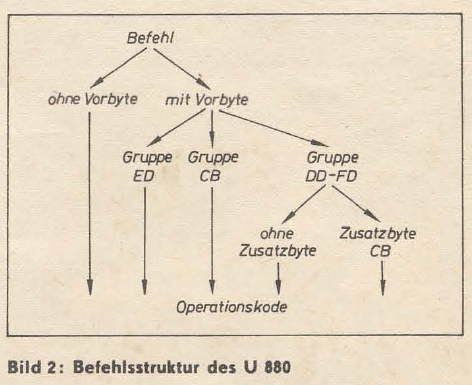

# Bestimmung der Befehlslängen von U880-Befehlen

In der Zeitschrift rfe (radio fernsehen elektronik) Ausgabe 8/1984 (Seite 478) ist das Hexlisting eines Programms abgedruckt, das die Befehlslänge von U880-Befehlen ermittelt. 

Der U880 (ein Z80-Clone) hat Befehle (Opcodes) mit unterschiedlichen Längen:

Der Quelltext wurde mit [z80dasm](http://www.tablix.org/~avian/blog/articles/z80dasm/) - einem Disassembler - rekonstruiert und mit einfachen Kommentaren angereichert.

In einem Z80-Emulator wurden die Befehlsfolgen grob getestet und das Programm für tauglich befunden. 
