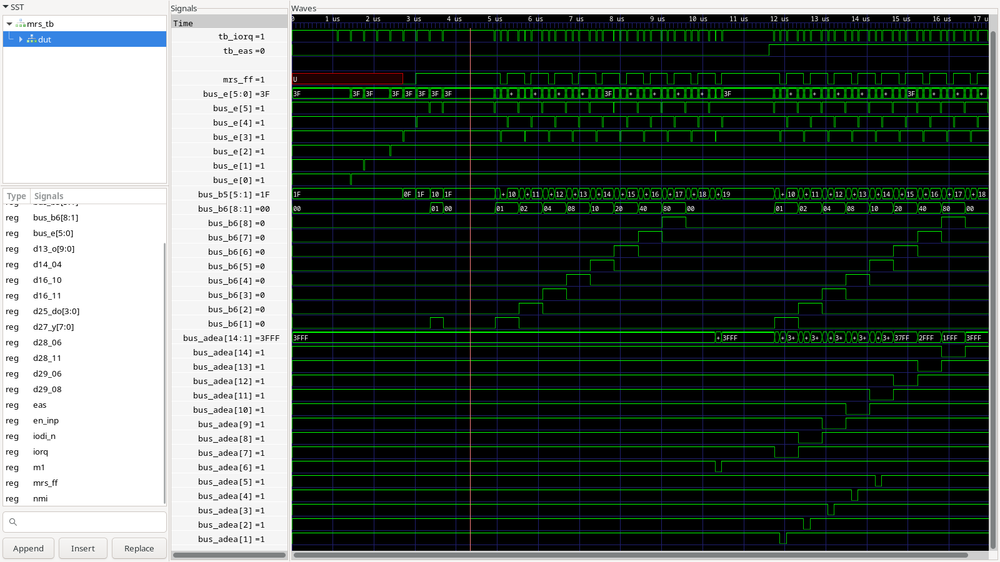

# Simulation der Ein- und Ausgabehardware vom MRS 701

## IO-Zugriffe auf Z80-Bus von 10h bis 70h (erster Teil)

- keine Zugriffe, wenn M1 aktiv ist, nur bei IORQ 
- 50h --> Strobe Flip-Flop Ausgang wird low-aktiv 
- 60h --> Strobe Flip-Flop wird deaktiviert (high) 
- 70h --> Speicherzugriff auf Latch, der Wert auf den Adressleitungen 11..8 wird gepeichert 

## Zugriffe auf das IO-Latch, wenn EAS = 0 ist (zweiter Teil)

- es erfolgen keine Zugriffe auf die Ein- und Ausgabebaugruppen
- Zugriff auf das Control-Register (ADEA6) ist möglich

## Zugriffe auf das IO-Latch, wenn EAS = 1 ist (dritter Teil)

- Zugriffe auf die Ein- und Ausgabebaugruppen sind möglich
- Zugriff auf das Control-Register (ADEA6) ist möglich

